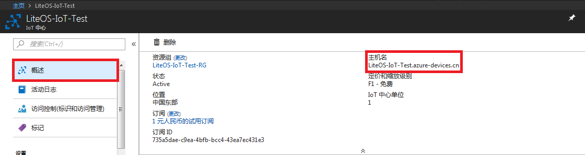
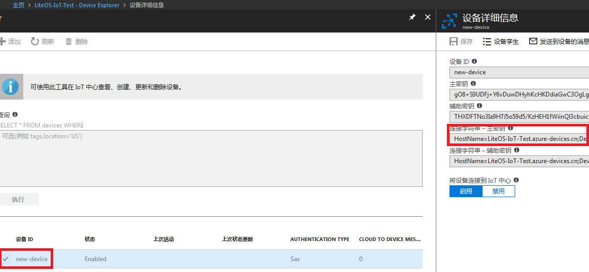

## 一、背景和介绍
### 1、公司/团队介绍

个人利用业余时间参与活动

### 2、项目介绍

LiteOS对接微软Azure IoT中心

## 二、项目内容

### 1. 方案说明

（1）功能说明

对接Azure IoT中心，实现消息发布和订阅

（2）接入说明

通过板载以太网接入网络和Azure IoT以MQTT实现通信

（3）Azure IoT简单介绍

azure物联网提供有 IoT套件/IoT中心/事件中心/流分析/通知中心，可对接的协议有 mqtt/amqp/http等

### 2. 硬件方案

- 利用野火开发板和Azure Iot通信

### 3. 软件方案
- LiteOS核心
- 开发板驱动
- STM32F4 HAL 库
- LWIP协议栈
- azure-iot-sdk-c

  - `c-utility` c常用库
  - `iothub_client` 应用层接口
  - `umqtt` MQTT协议
  - `parson` JSON解析

- wolfssl

## 三、接入第三方云平台

### Azure Portal注册
- [国际节点](https://azure.microsoft.com/zh-cn/)
- [国内节点](https://www.azure.cn/zh-cn/)
- [注册 1 元试用订阅](https://docs.azure.cn/zh-cn/billing/billing-sign-up-azure-account-with-1rmb-trial-subscription)

**几个坑**
1. 注册完成后会扣1单位当地货币，主要选择国内站点注册
2. 微软账户和门户是不同的账户。一定要分清楚了！！！注册完成后的id类似cietest.partner.onmschina.cn，一定要记住了！！！！！！！！！！！！！！！！！

### 创建 Aure IoT中心

创建 IoT 中心以后，即可找到将设备和应用程序连接到 IoT 中心时需要使用的重要信息。
1. 创建 IoT 中心后，请在仪表板中单击它。 记下“主机名”，并单击“共享访问策略”。

2. 在“共享访问策略”窗格中单击“iothubowner”策略，并复制并记下 IoT 中心的连接字符串。 有关详细信息，请参阅[控制对 IoT 中心的访问](https://docs.azure.cn/zh-cn/iot-hub/iot-hub-devguide-security)。


- 在 IoT 中心为设备进行设备注册

1. 在 [Azure 门户](https://portal.azure.cn/)中打开 IoT 中心。
2. 单击“设备资源管理器”。
3. 在“设备资源管理器”窗格中，单击“添加”将设备添加到 IoT 中心。 然后执行以下操作：

    **设备 ID**：输入新设备的 ID。 设备 ID 区分大小写。
    **身份验证类型**：选择“对称密钥”。
    **自动生成密钥**：选中此复选框。
    **将设备连接到 IoT 中心**：单击“启用”。

4. 单击“保存” 。
5. 创建设备后，在“设备资源管理器”窗格中打开设备。
6. 记下连接字符串的主密钥。


### [使用DevicExplorer进行模拟, 点我](https://github.com/Azure/azure-iot-sdk-csharp/tree/master/tools/DeviceExplorer)

在 ubuntu 上可编译 sdk 进行设备模拟，收发消息。

设置开发环境
```
sudo apt-get update
sudo apt-get install -y git cmake build-essential curl libcurl4-openssl-dev libssl-dev uuid-dev
```
检查cmake版本不小于2.8.12
```
cmake --version
```
检查gcc版本不小于4.4.7
```
gcc --version
```
编译sdk
```
cd azure-iot-sdk-c
mkdir cmake
cd cmake
cmake ..
cmake --build .  # append '-- -j <n>' to run <n> jobs in parallel
```
设置字符串
```
static const char* connectionString = "[device connection string]";
```
编译例子代码
```
cd ./azure-iot-sdk-c/cmake/serializer/samples
make
./simplesample_mqtt/simplesample_mqtt
```

观察DevicExplorer及由DevicExplorer下发命令

下发命令格式`simplesample_amqp`
```
{"Name":"SetAirResistance","Parameters":{"Position":55}}
{"Name":"TurnFanOn","Parameters":{}}
```

gif动画演示在本文档同级目录meta/azure-virtual-equipment-device-explorer-demo.gif

## 四、关键源代码解析

### 1. wolfssl移植: 一开始的时候，编译很多的错误，主要配置在 user_settings.h

- 获取代码
  - `git clone https://github.com/wolfSSL/wolfssl.git`
- internal.c

  - `LowResTimer()`

- memory.c
  - `malloc()` -> `platform_malloc()`
  - `realloc()` -> `platform_realloc()`
  - `free()` -> `platform_free()`
- random.c
  - `wc_GenerateSeed()`中，`hrng.Instance = RNG;`改为`hrng.Instance = ((RNG_TypeDef *) RNG_BASE);`，否则报错
- wc_port.c
  - `wc_InitMutex()`
  - `wc_FreeMutex()`
  - `wc_LockMutex()`
  - `wc_UnLockMutex()`
- 下面几个文件也进行了适配
  - asn_public.h
  - wc_port.h
  - internal
- 为了不让编译报错，增加几个空文件

  - options.h
  - rl_net.h
  - strings.h
- 增加 user_settings.h 以便进行客制化
- 为了使用user_settings.h，`Project` --> `Options for Target 'HuaweiLiteOS'`...--> `C/C++` --> `Define`,在行末加上 `,WOLFSSL_USER_SETTINGS`

### 2. SDK 的要求

- 能够IP连接
- 支持TLS
- 支持SHA-256（可选），有些协议需要，有些不需要
- 有硬件时钟或者可以连接 NTP 服务器
- 至少64K的RAM

### 3. [C SDKs API 参考](https://azure.github.io/azure-iot-sdk-c)，这主要是针对上层调用的文档

### 4. sdk 移植

- 获取 sdk
  - `git clone --recursive https://github.com/Azure/azure-iot-sdk-c.git`
- [移植指导,本文档同级目录下的 `porting_guide.md` ](./porting_guide.md)
- sdk 没有实现ssl，所以需要移植第三方库。个人觉得，相对于openssl/mbedstl，wolfssl更简单。wolfssl是轻量级的，很适合嵌入式
- 采用的是上层应用<-->iothub_client<-->tlsio<-->socket
- 适配文件: 主要在adapters目录下

  - `agenttime_liteos.c` 主要实现 
    - `get_time()`
    - `get_difftime()`
    - 其余是打酱油的
  - `platform_liteos.c` 
    - `platform_init()`
    - `platform_get_default_tlsio()`
    - `platform_get_platform_info()`
    - `platform_deinit()`
    - 另外，我还增加了几个适配平台的函数
    - `platform_pool_init()`
    - `platform_malloc()`
    - `platform_realloc()`
    - `platform_calloc()`
    - `platform_free()`
  - threadapi_liteos.c
    - `ThreadAPI_Sleep()`
    - 其余打酱油
  - tickcounter_liteos.c
    - `tickcounter_create()`
    - `tickcounter_destroy()`
    - `tickcounter_get_current_ms()`
  - `tlsio_ssl_liteos.c` 相对较复杂，主要作用是对上层提供接口 `tlsio_openssl_get_interface_description()`给sdk，然后调用 wolfssl 和 lwip 进行通信

### 例子代码

- iothub_client_sample_mqtt.c
  - 入口 `iothub_client_sample_mqtt_run()`

### 5. 踩过的坑
- 因为用malloc/realloc分配不到内存，写了platform_malloc/platform_realloc/platorm_free, 将 azure-iot-sdk-c 和 woflSSl 的 malloc/realloc/free 全部置换为 platform_malloc/platform_realloc/ platform_free
- 所有 `time()` 函数置换成 `get_time()` 函数
- sntp校时

  - SNTP_SERVER_DNS 设为1，并且 设置 SNTP_SERVER_ADDRESS
  - 如果SNTP_SERVER_DNS设为0，在 sntp_init 开始之前 sntp_setserver
  - sntp服务器的选择也是靠运气的，有时候很长时间都获取不到时间，有时候就很快，

- dns域名解析

  - 设置 DNS_SERVER_ADDRESS
  - dns服务器也的选择也是靠运气，网上搜索，换了几个才行

- 必须定义 STRINGS_C_SPRINTF_BUFFER_SIZE，否则 azure sdk的域名解构会为空
- 开启LWIP_TCP_KEEPALIVE，否则TCP_KEEPIDLE, TCP_KEEPINTVL and TCP_KEEPCNT设置会失败
- 在wc_InitMutex中，LOS_SemCreate创建成功后LOS_SemPost，否则在wc_LockMutex中task会一直等待
- sockets.c中定义了自己的errno`int errno;`导致在EmbedReceive中`int err = wolfSSL_LastError();`返回值一直为0。将自定义的errno注释掉即可返回正确的值。或者用`(*(volatile int *) __aeabi_errno_addr()) `替换`errno`也是可以的
- 目前 ssl 连接失败，查看原因是 没有签名者确认（？）


- 已经到deadline了，没有时间继续调试了

## 五、产品调试


板子连线如上图

调试动画在本文档同级目录下的meta/degug.gif

下载完毕后按RESET即可运行代码

## 六、第三方云平台能力展示

无

## 七、评审验证

### 1. 提供云平台评审账号

私下提供

### 2. 评审所用工具及软件

keil mdk525

链接：<https://pan.baidu.com/s/1XfZbGtjOXCVWT5fIttC4FQ> 密码：lfvk

其他工具

链接：<https://pan.baidu.com/s/1K2KE99g3mFzjctGeW9OwNg> 密码：5q92

**最后，是使用过程中对LiteOS的一些建议**
- 没有 mailbox API 说明，或者说还没有实现 mailbox
- 静态内存的 API 实现和文档说明不一致
- cmsis_os2.h API 和 cmsis_os1.h API不一致